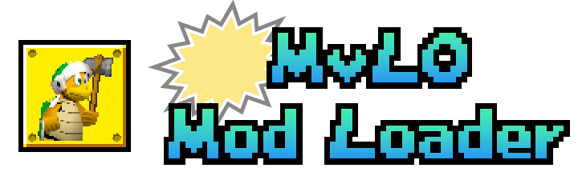

Standalone, self-updating, portable program to install and launch [Mario vs Luigi Online](https://ipodtouch0218.itch.io/nsmb-mariovsluigi) mods. Powered by the Godot Engine!

## Downloads

Go to the repository's releases or use these shortcuts to the latest builds:

- [**Windows**](https://github.com/vlcoo/MvLO-ModLoader/releases/latest/download/MvLOMLWindows-Setup.exe)
- [**Windows (Portable)**](https://github.com/vlcoo/MvLO-ModLoader/releases/latest/download/MvLOMLWindows-Portable.exe) - use this version if the one above fails.
- [**Linux**](https://github.com/vlcoo/MvLO-ModLoader/releases/latest/download/MvLOMLLinux.x86_64)
- [**MacOS**](https://github.com/vlcoo/MvLO-ModLoader/releases/latest/download/MvLOMLMacOS.zip)

## Usage

Navigate either to the vanilla or the mods using the tabs at the top. You can choose what version and what platform to install (availability may differ across mods - make sure to get the platform compatible with your device's OS). Finally, choose the Install button to download and be able to Launch the chosen mod!

Some advanced settings are also available, like update notifications and custom launch arguments.

## Discord

Join the discord servers to keep up to date with its development, make feature suggestions, report bugs (if you're too lazy to use issues...) and get technical support...

https://discord.gg/dgKVaUKpj5

https://discord.gg/cKgE8dsV7t
